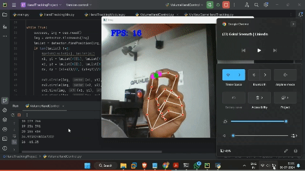

  <h1>Gesture Volume Control Using OpenCV and MediaPipe</h1>
  
 

Utilizing OpenCV and MediaPipe, created an innovative system that enables volume adjustment through simple hand gestures. The program captures video from a webcam and monitors the movement of the thumb and index finger. By measuring the distance between these fingers, the system interprets hand gestures to adjust the volume.
